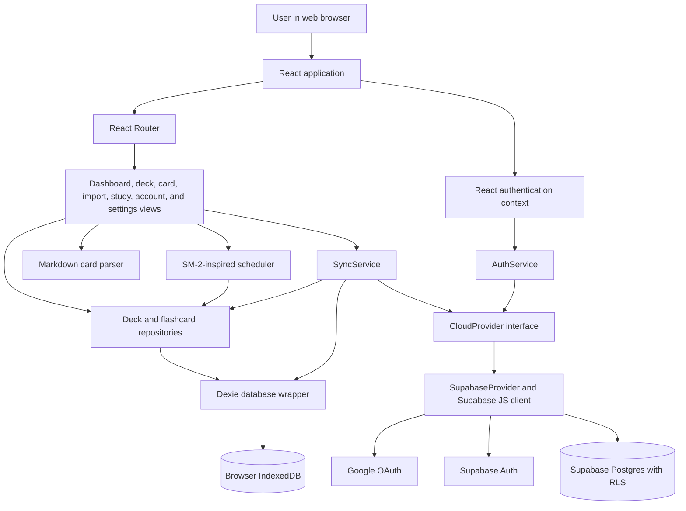

# CardOn

> A local-first Flash Card application for creating study decks, importing structured notes, and scheduling reviews with spaced repetition, with optional on-demand sync across devices after signing in with Google

[View the live application](https://card-on.netlify.app/)

## Description

CardOn is designed for students, interview candidates, and self-directed learners who want a focused way to turn questions and answers into repeatable study sessions. Users can organize flashcards into decks, see what is due, review cards using four recall ratings, **import batches of cards from a simple Markdown-like format**, and back up their browser data as JSON.

The uses a local-first React architecture, typed data modelling, IndexedDB persistence, an SM-2-inspired scheduling algorithm, parser validation, Google OAuth, Supabase row-level security, provider-based service boundaries, cloud synchronization, automated tests, CI checks, and static SPA deployment configuration.

## Feature highlights

| Feature | Description | Technical concepts |
| --- | --- | --- |
| Deck and card management | Create, view, edit, and delete decks and flashcards through route-based forms and detail views. | React forms, controlled inputs, client-side validation, CRUD workflows, UUID generation, repository pattern, typed domain models, programmatic navigation |
| Due-card dashboard | Displays card totals and the number due for each deck using data queried from IndexedDB. | Derived state, asynchronous effects, indexed browser storage, date-based filtering, parallel queries |
| Spaced-repetition study flow | Presents due cards one at a time, reveals optional hints and notes, and reschedules each card from an `Again`, `Hard`, `Good`, or `Easy` rating. | Pure domain logic, immutable calculations, state-machine-style UI flow, persistence after user actions, unit testing with controlled time |
| **Structured card import** | Accepts pasted text or `.md`/`.txt` files using `Q:`, `A:`, `Hint:`, and `Note:` fields, previews parse results, and imports valid cards in bulk. | FileReader API, parsing, validation, error reporting, bulk database operations, separation of parsing from presentation |
| Local-first persistence | Stores decks, cards, scheduling metadata, and the study-session data model in browser IndexedDB through Dexie. Core deck and study workflows do not wait for a network request. | IndexedDB, offline-capable data access, schema design, repository abstraction, browser persistence |
| Google sign-in | Starts a Google OAuth flow through Supabase and exposes session state to the component tree. | OAuth 2.0 integration, authentication state subscriptions, React Context, service/provider abstractions |
| Manual cloud synchronization | Authenticated users can explicitly push their local dataset to Supabase and then download and merge remote records. | API integration, asynchronous orchestration, upserts, last-write comparison, multi-device data design, error handling |
| JSON backup and restore | Exports all local tables to a downloadable JSON file and restores a selected backup after confirmation. | Blob and object URL APIs, serialization, file input, destructive-action confirmation, data portability |
| Responsive application shell | Provides shared navigation, empty states, desktop/mobile grid layouts, labelled icon controls, and consistent design tokens. | Component composition, responsive Tailwind utilities, semantic controls, basic accessibility attributes, reusable visual primitives |
| Database authorization | Supplies SQL for user-owned Supabase tables protected with row-level security policies. | PostgreSQL schema design, foreign keys, cascading deletes, indexes, authorization at the data layer |

## Architecture

CardOn is a client-rendered single-page application. React pages coordinate user interactions, repository objects isolate local persistence, and small utility modules contain domain logic that can be tested without rendering the UI. Authentication and cloud storage sit behind a `CloudProvider` interface; the included implementation uses the Supabase JavaScript client.



### Main data flows

1. **Local CRUD:** A route renders a feature page, the page calls `DeckRepository` or `FlashcardRepository`, and the repository reads or writes the Dexie-managed IndexedDB database. React state is then refreshed or the router navigates to the next view.
2. **Review scheduling:** The study page loads cards whose `dueDate` is today or earlier. A recall rating is passed to the pure `applySM2` function, and the resulting interval, repetition count, ease factor, and due date are persisted to the card.
3. **Markdown import:** Text from a paste action or local file is passed to `parseMarkdown`. The page separates valid and invalid candidates, bulk-adds valid cards, and keeps invalid records visible for correction.
4. **Authentication:** `AuthProvider` wraps the application. `AuthService` relays Supabase auth-state changes through React Context, while `SupabaseProvider` starts Google OAuth and manages the current cloud user.
5. **Cloud sync:** The settings page creates `SyncService`, pushes all three local tables through `SupabaseProvider`, then downloads the authenticated user's rows and merges newer remote deck/card records into IndexedDB. Sync is manual; no background worker is implemented.
6. **Backup and restore:** The settings page serializes the three local tables to JSON for download. Restore reads JSON in the browser and replaces the local tables after user confirmation.

## Technology stack

| Area | Technology |
| --- | --- |
| Frontend | React 19, TypeScript, JSX |
| Routing | React Router DOM |
| Styling | Tailwind CSS 4, custom CSS theme tokens, Noto Sans via Google Fonts |
| Client state | React hooks and React Context |
| Local database | IndexedDB through Dexie 4 |
| Domain logic | SM-2-inspired TypeScript scheduler and a custom structured-text parser |
| Authentication | Supabase Auth with Google OAuth |
| Cloud database | Supabase Postgres |
| Authorization | PostgreSQL row-level security policies scoped by Supabase user ID |
| Client API integration | Supabase JavaScript SDK |
| Testing | Vitest, fake-indexeddb |
| Code quality | TypeScript build checks, ESLint, Prettier, Husky |
| Build tooling | Vite 8, npm |
| CI | GitHub Actions |
| Deployment configuration | Netlify static hosting with SPA redirect rules |

The package manifest also contains React Markdown, KaTeX, Remark, and Rehype packages, but the current source does not import them. They are therefore not presented as implemented application capabilities.

## Repository structure

```text
CardOn/
|-- src/
|   |-- components/       # Shared layout, authentication context, avatars, and reusable UI
|   |-- database/         # Dexie database declaration and IndexedDB table indexes
|   |-- models/           # TypeScript models for decks, cards, and study sessions
|   |-- pages/            # Route-level dashboard, CRUD, import, study, account, and settings views
|   |-- providers/        # CloudProvider contract and Supabase implementation
|   |-- repositories/     # Local deck and flashcard persistence operations
|   |-- services/         # Authentication relay and local/cloud synchronization orchestration
|   |-- utils/            # Spaced-repetition algorithm and card import parser
|   |-- App.tsx           # Application composition and route table
|   |-- main.tsx          # React root and browser-router bootstrap
|   `-- index.css         # Tailwind import and application design tokens
|-- tests/
|   |-- db/               # IndexedDB schema and data-operation tests
|   `-- utils/            # Scheduler and parser unit tests
|-- supabase/
|   `-- schema.sql        # Cloud tables, foreign keys, indexes, and RLS policies
|-- .github/workflows/
|   `-- ci.yml            # Install, type-check, lint, and production-build workflow
|-- .husky/
|   `-- pre-commit        # Runs the Vitest suite before commits
|-- netlify.toml          # Netlify build output and SPA fallback configuration
|-- vite.config.ts        # React, Tailwind, and Vitest configuration
|-- eslint.config.js      # TypeScript and React lint rules
|-- tsconfig*.json        # Application and build-tool TypeScript projects
`-- package.json          # Dependencies and development scripts
```